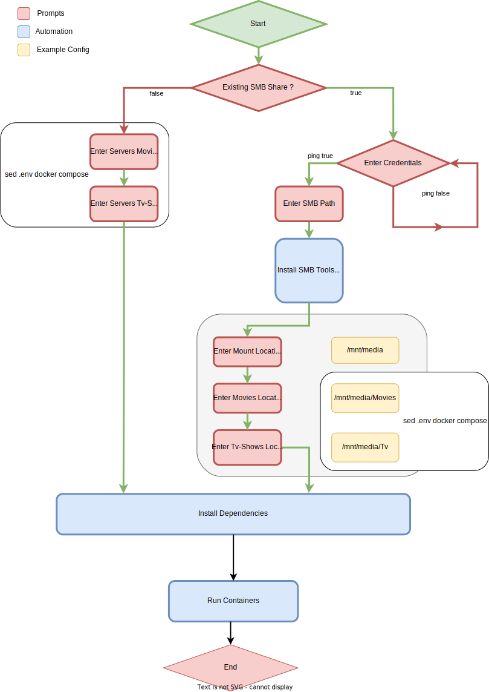

# Homeserver Automation with Ansible and Docker Documentation

# Requirements

## Ansible Node
- Static Ip Configuration (LAN)
- SMB Share (optional)
- Running Open SSH Service with configured public and private Key
- Ansible Installed

## Ansible Client
- SSH public Key transfered to Ansible Node
- Ansible Installed

# Flow Diagram (Not all Features not yet Implemented)


# How To (Under Construction)
## Clone Repository

```bash
git clone https://github.com/prax93/homeserver.git

```
## Navigate to playbook Folder 

```bash
cd homeserver/playbook
```

## Edit hosts.yml file in ./playbook
```yaml
[HomeServer]
192.168.0.100 #Replace with your Servers IP

[HomeServer:vars]
ansible_user=ubuntu #Replace with your Servers Username
```


## Give Running Permissions for init.sh
```bash
cd ..
sudo chmod +x init.sh
```

## Run Init Script
```bash
sh ./init.sh
```


# To do's
- [x] Enter server credentials
- [x] Ask for smb share
- [x] If smb share not existent: Skip cifs install
- [x] If smb share not existent: Skip mounting smb share
- [x] Create Docker Group and append User to the Group
- [x] Enter Samba Share Location (ip:/sharedFolder) when samba exists
- [ ] Variable Automation
- [ ] Testing
- [ ] Documentation
- [ ] How to

## Future Requests

- [x] Shell Script to install Ansible Client & Node
- [x] Shell Script to create SSH Keys and automatic Transfer
